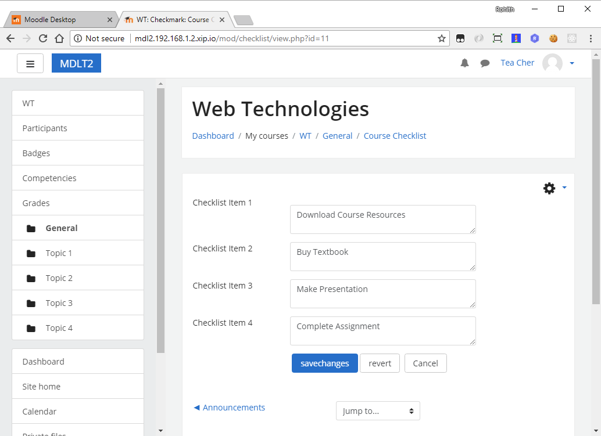
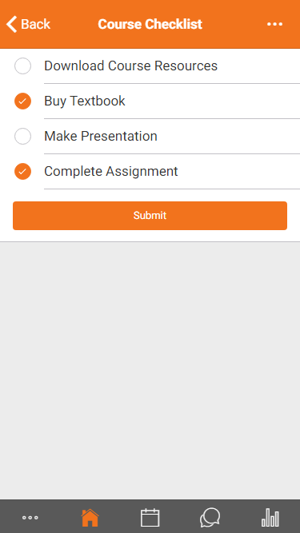
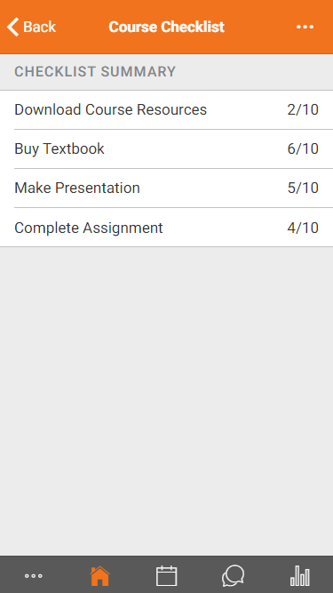

# Moodle Checklist Plugin

I've created a simple activity moodle plugin to check out the new moodle mobile spec for extending existing plugins to the mobile app using only PHP code, templates, and Ionic markup. 

This plugin enables the teacher to create a simple checklist for a course. The students can view the checklist of the course and mark checklist item as complete as they progress through the course. The teacher can view the summary of total students who completed a particular checklist item.

## Modules
* [Creating Checklist](#creating-checklist)
* [Marking Checklist Items](#marking-checklist-items)
* [Checklist Summary](#checklist-summary)

## Creating checklist

The teacher can add a new checklist on course by **add an activity or resource**. The Teacher can then define the checklist items and save them. The number of checklist items is set in instance settings. 

## Marking Checklist Items

The student can view the checklist by clicking on plugin instance in the course. The student can then mark one or more checklist items as complete and submit it.

## Checklist Summary

The teacher can view the summary of the number of students who have completed a particular checklist item of the course.

